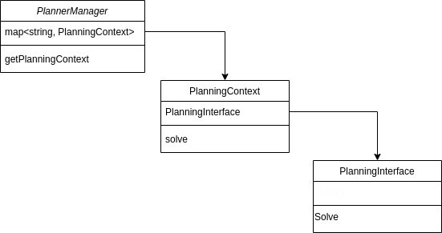

# Structure of the OMPL interface code in MoveIt

This page describes how the OMPL interface code is structured. This is useful because it is not trivial. It's a combination of 39 files containing 7759 lines of C++ code.

## Recommended reading

Some basic concepts of planning plugins will be explained here. But if you are not familiar with planning plugins, it can be useful to read the following tutorials:

- [Motion Planning API](https://ros-planning.github.io/moveit_tutorials/doc/motion_planning_api/motion_planning_api_tutorial.html)
- [Creating MoveIt Plugins](https://ros-planning.github.io/moveit_tutorials/doc/creating_moveit_plugins/plugin_tutorial.html)

## Generic planner interface in MoveIt

This *generic* description is based on the plugin tutorial mentioned above, and the existing interface of CHOMP and TrajOpt.

The main entry point for planners is through the `PlannerManager`, inheriting from the base class `planning_interface::PlannerManager`. This is the class that is exposed as a plugin to load planners at runtime. Being a plugin, this means that we do not have to link the planner at compile time. Any plugin that is registered (but not linked) can be used at runtime to execute planning requests.

The `PlannerManager` does not have a `solve` method, but is used to create a `PlanningContext` to solve a specific planning problem. The planning context is created from a planning scene and a motion plan request. `PlanningContext` has a `solve` method, but often does not implement this, but passes another a `PlannerInterface` class that implements the actual planner.

## OMPL's interface

OMPL's interface is structured slightly different. The planner interface class, called `OMPLInterface`, is a member of the `OMPLPlannerManager`. `OMPLInterface` is not embedded directly into a planning context. Also, the planning context is not created and saved in the planner manager, but in `OMPLInterface`. `OMPLInterface` does not directly handle a planning context, but has a `PlanningContextManager` member.

The `PlanningContextManager` selects the correct type of planning contexts. It is this planning context class, `ModelBasedplanningContext` that contains OMPL's `SimpleSetupPtr` to solve a planning problem.

Most of the code not discussed models an OMPL `StateSpace` and handles constraints.