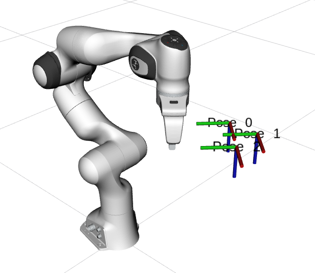
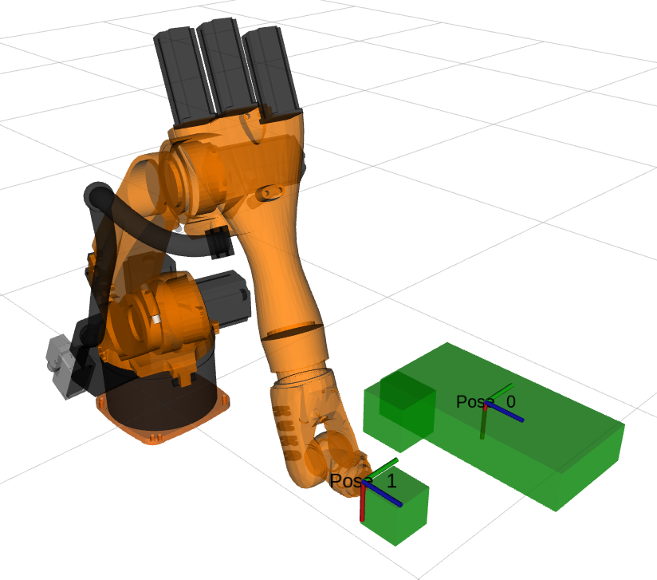
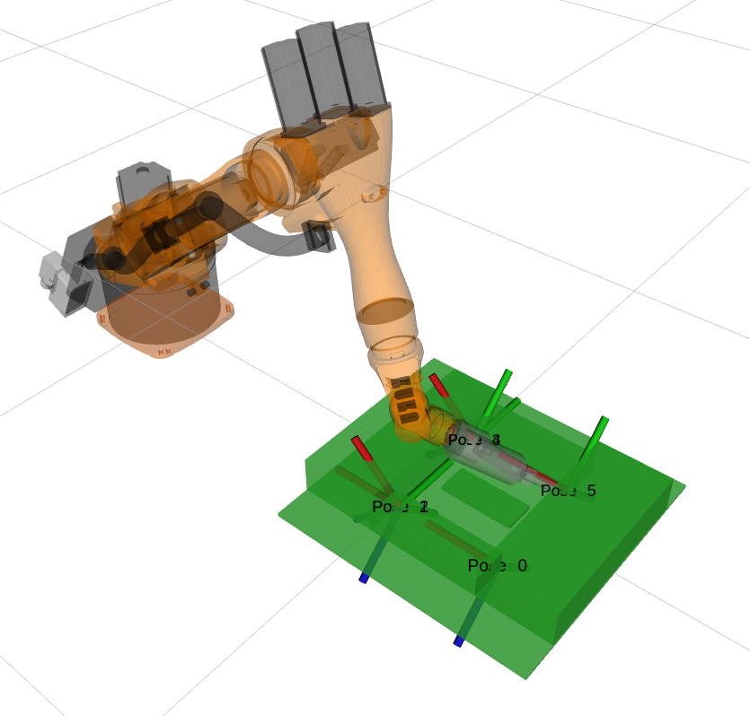

# Path planning with end-effector constraints

This repository contains scripts to run some example problems.
It does **not** contain the robot setups. I use the [panda_moveit_config](http://wiki.ros.org/panda_moveit_config) package for some demos, and [benchmark_planning_setups](https://github.com/JeroenDM/benchmark_planning_setups) for others.

The idea behind the cases is to cover a spectrum from very little constraints on the end-effector, to highly constrained end-effector paths. This can be seen as the grey area in between free space planning and Cartesian path following.

## Installation

TODO discuss how to setup the workspace for these demos. Add a ros install file for wstool.

## Interface

TODO write my notes on the interface, GetMotionPlan vs GetCartesianPath.

## Demo cases
### Case 1
Hold the end-effector of the panda robot upright (not done yet).



### Case 2
Move the last link of a Kuka kr5 robot in between some boxes. The end-effector's position is specified (move along a line), but the orientation is not.

```
roslaunch setup_1_moveit_config demo.lauch
```

```
rosrun cart_planning_demo case_2.py
```



### Case 3

An arc welding example, also with the Kuka kr5 that has a torch mounted at the end. Three weld lines are considered as a single long Cartesian path. This avoids that we have to handle the transition between free space motion and Cartesian path following. This is the domain of the MoveIt Task Constructor.

As constraints go, the rotation around the torch's symmetry axis is unconstrained. This is the z-axis of the tool frame. In addition, we can add some tolerance on the rotation around the y-axis of the tool frame to avoid collision with the work object at the start end the end of the weld line.

```
roslaunch setup_4_moveit_config demo.lauch
```

```
rosrun cart_planning_demo load_work_object_case_3.py
rosrun cart_planning_demo case_3.py
```

